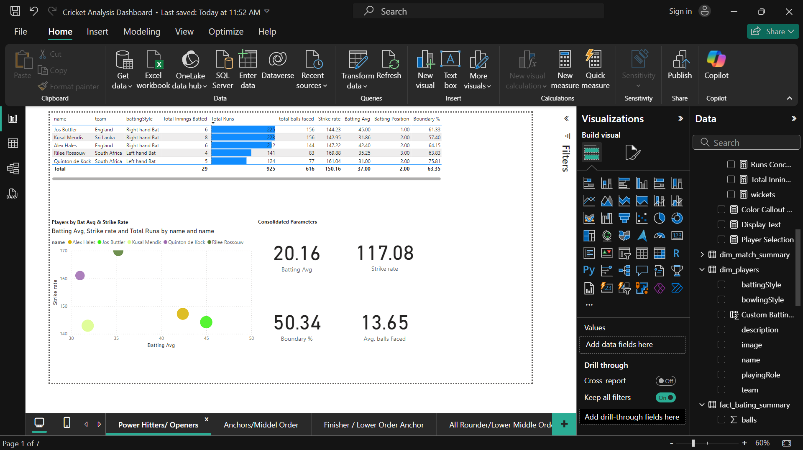

# Cricket Analysis Dashboard 🏏📊

## Overview
The Cricket Analysis Dashboard is a data analysis and visualization project focused on cricket statistics. The goal of this project is to analyze cricket data, generate insights into player performance, and recommend the best possible team combinations (such as Dream 11). The project employs data scraping, preprocessing, analysis, and interactive visualizations using Power BI.
## Features
Data Collection: Scraped cricket statistics from the ESPN Cricinfo website to collect raw player and match data.

Static Data Analysis: The scraped data is analyzed to identify trends, evaluate player performance, and build the best team. Note: The data is scraped only once and does not update automatically.

Interactive Dashboard: Visualized the processed data using Power BI, providing insights such as:

1) Top-performing players by categories (e.g., batting, bowling, all-rounders).

2) Country-wise performance analysis.

3) Optimal team selection based on past performance statistics.

## Screenshots

